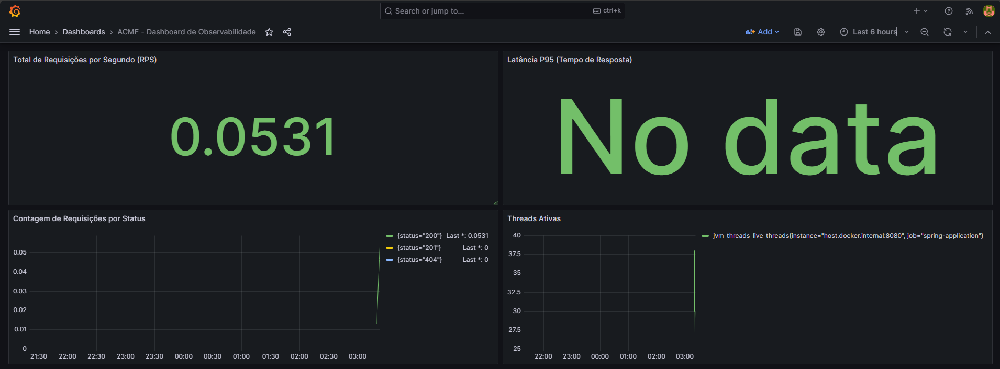
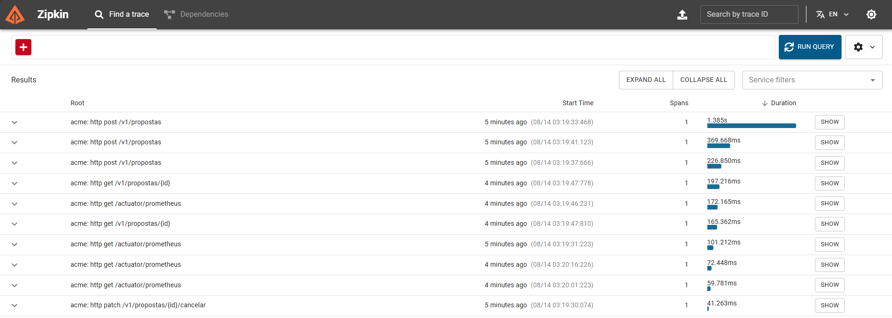
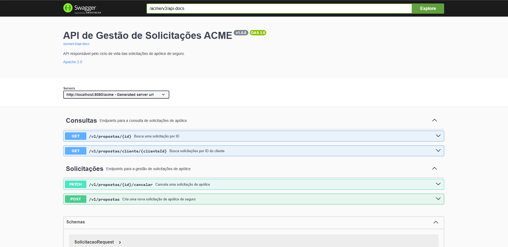

---

### 📈 Usando Ferramentas de Observabilidade

Aqui está um guia rápido para acessar e usar o Grafana e o Zipkin para monitorar a sua aplicação.

#### **1. Acessando o Dashboard do Grafana**

Você não precisa criar o dashboard manualmente; ele já está pré-configurado via provisionamento.

1.  Acesse o Grafana no seu navegador: **`http://localhost:3000`**.
2.  Faça login com as credenciais padrão: `admin` / `admin`.
3.  No menu lateral (canto superior esquerdo), clique em **Dashboards**.
4.  Selecione o dashboard **"ACME - Dashboard de Observabilidade"** para ver métricas da sua aplicação em tempo real.

#### **2. Rastreando Requisições com o Zipkin**

O Zipkin permite visualizar o fluxo completo e a latência de uma requisição.

1.  Acesse a interface do Zipkin: **`http://localhost:9411`**.
2.  Clique no botão **"Run Query"** para buscar os traces mais recentes.
3.  Você verá uma lista de requisições. Clique em uma delas para ver o detalhe do trace, mostrando quanto tempo cada operação (chamadas de API, acesso ao banco de dados) levou.

### 📚 Usando o Swagger UI (Documentação da API)

O Swagger UI fornece uma interface interativa para explorar e testar os endpoints da sua API diretamente no navegador.

1.  Acesse a documentação da API em **`http://localhost:8080/acme/swagger-ui.html`**.
2.  Expanda um dos endpoints (ex: `POST /acme/v1/propostas`) para ver a sua documentação.
3.  Clique em **"Try it out"** no canto direito do endpoint.
4.  No campo **"Request body"**, você pode editar o JSON da requisição.
5.  Clique em **"Execute"** para enviar a requisição para a sua aplicação.
6.  A resposta da API será exibida abaixo, mostrando o `Response body`, `Response headers` e o `cURL` da requisição.

### 🕵️‍♂️ Verificando as Chamadas com o WireMock

O WireMock permite que você veja as requisições que a sua aplicação enviou para a API de mock. Isso é útil para depuração e para validar se a sua aplicação está fazendo as chamadas corretamente.

1.  Acesse a interface do WireMock em **`http://localhost:8081`**.
2.  Para ver as regras de mock configuradas (o que o WireMock espera e o que ele retorna), acesse: **`http://localhost:8081/__admin/mappings`**.
3.  Para ver o log de todas as requisições que sua aplicação enviou para o WireMock, acesse: **`http://localhost:8081/__admin/requests`**.